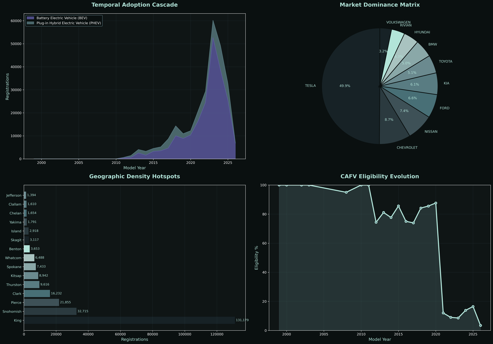
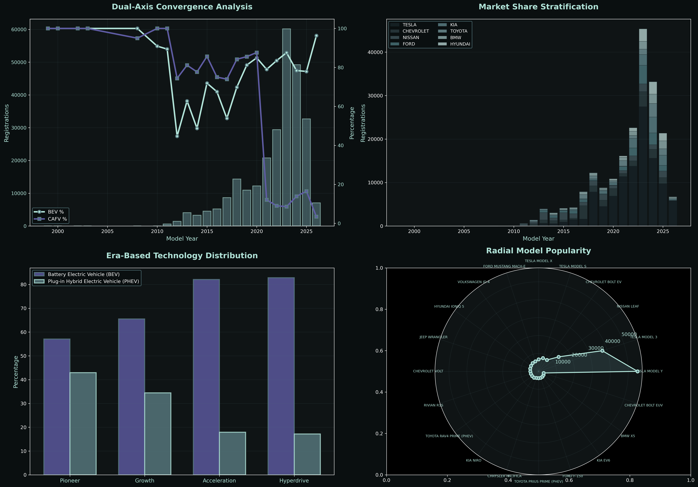
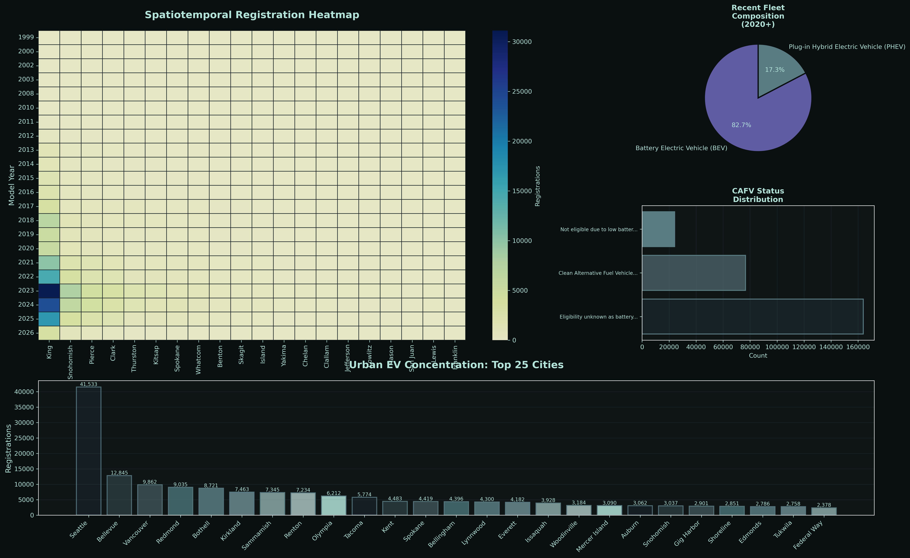
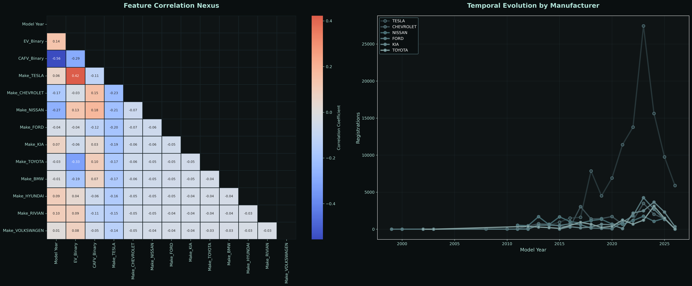
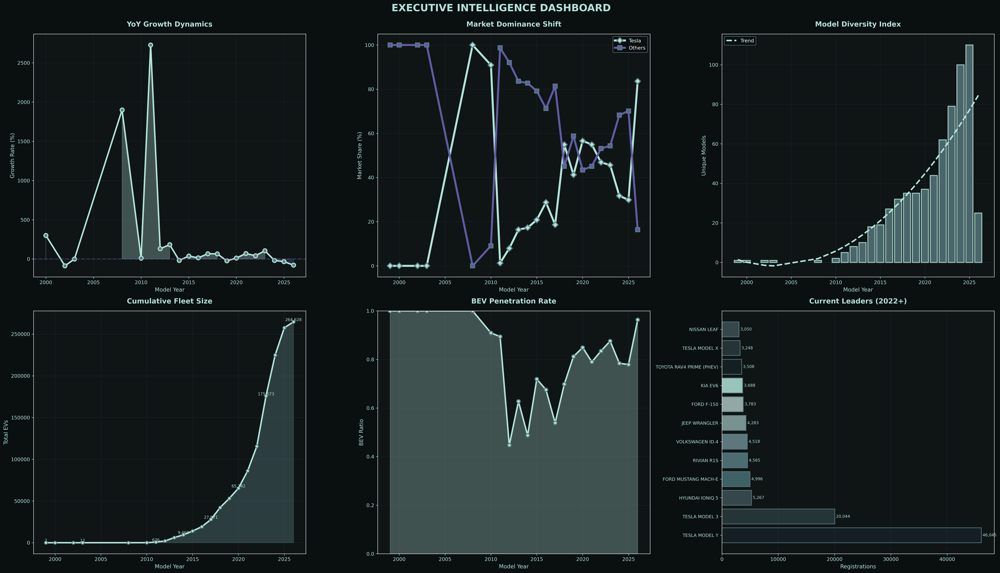
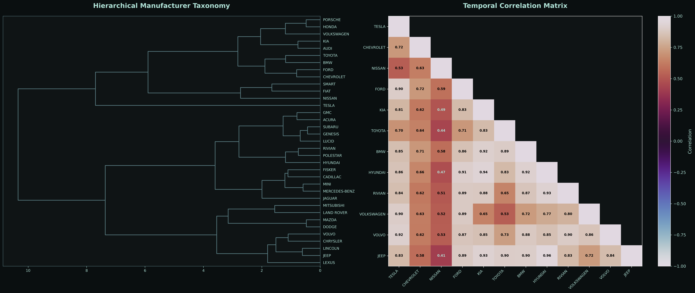
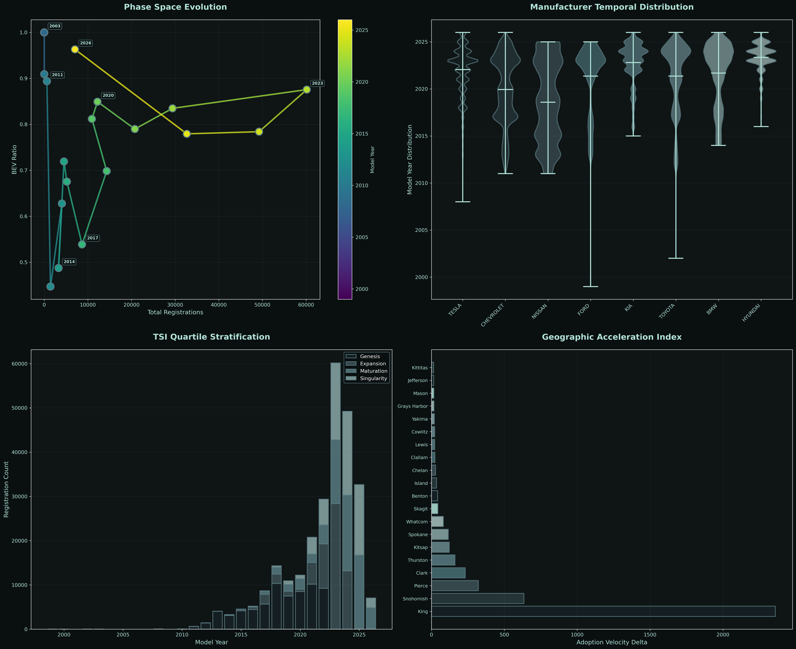
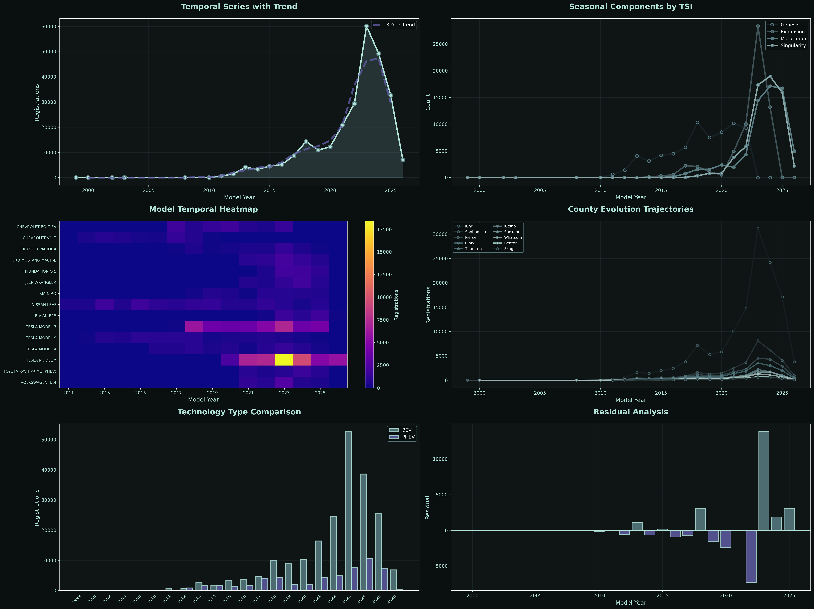

# Electric Vehicle Population Analysis


Advanced analytical framework for examining electric vehicle registration patterns, market dynamics, and adoption trajectories across 264,000+ records.

## Overview

Two complementary analysis frameworks explore EV fleet evolution through statistical methods, machine learning, and novel dimensionality reduction techniques.

| Framework | Focus | Visualizations |
|-----------|-------|----------------|
| **Quantum Analysis** | Classical statistical methods and temporal trends | 7 visualization suites |
| **Advanced Analysis** | TemporalSpatialIndex and dimensional reduction | 5 visualization suites |
| **Educational Synthesis** | Mathematical explanations and methodology | Interactive HTML document |

## Dataset

**Source:** [Electric Vehicle Population Dataset](https://www.kaggle.com/datasets/alamshihab075/electric-vehicle-population-dataset)

| Attribute | Value |
|-----------|-------|
| Total Records | 264,628 |
| Columns | 17 |
| Geographic Focus | Washington State (primary) |
| Time Span | 1999-2026 |
| Vehicle Types | BEV and PHEV |

## Key Features

### TemporalSpatialIndex Framework
Novel composite scoring system combining temporal, spatial, and market dimensions into unified metric. Enables quartile stratification from Genesis through Singularity phases.

### Advanced Techniques
- Principal Component Analysis for dimensionality reduction
- K-means clustering in reduced feature space
- Hierarchical manufacturer taxonomy with Ward linkage
- Geographic acceleration analysis via velocity derivatives
- Phase space trajectory visualization
- Correlation network construction

### Visualization Suite
All visualizations rendered at 300 DPI with consistent color palette optimized for dark backgrounds and perceptual uniformity.

## Installation

```bash
git clone https://github.com/Cazzy-Aporbo/Electric-vehicle-population.git
cd Electric-vehicle-population
pip install pandas numpy matplotlib seaborn scikit-learn scipy
```

## Usage

### Quantum Analysis
```bash
python ev_quantum_analysis.py
```

Generates 7 visualization files:
- temporal_cascade.png
- dimensional_reduction.png
- statistical_manifold.png
- advanced_distribution.png
- correlation_nexus.png
- executive_synthesis.png
- neural_insights.png

### Advanced Analysis
```bash
python ev_advanced_analysis.py
```

Generates 5 visualization files:
- hierarchical_taxonomy.png
- phase_space_trajectories.png
- market_topology.png
- temporal_decomposition.png
- multidimensional_scatter.png

### Educational Documentation
Open `ev_analysis_synthesis.html` in any browser for comprehensive methodology explanation.

## Visualizations

### Temporal Cascade

Stacked area charts showing adoption dynamics, market dominance, geographic hotspots, and CAFV eligibility trends.

### Dimensional Reduction

PCA-based model space visualization with K-means clustering taxonomy showing fleet composition in reduced feature space.

### Statistical Manifold

Dual-axis convergence analysis, market share stratification, era-based technology distribution, and radial popularity plots.

### Advanced Distribution

Spatiotemporal heatmap of county-year registrations with urban concentration analysis across top 25 cities.

### Correlation Nexus

Feature correlation matrix with temporal manufacturer evolution trajectories.

### Executive Synthesis

YoY growth dynamics, market dominance shifts, model diversity indices, cumulative fleet growth, and BEV penetration rates.

### Hierarchical Taxonomy

Dendrogram showing manufacturer relationships and temporal correlation matrix.

### Phase Space Trajectories

Evolution of market size versus BEV adoption with TSI quartile stratification and geographic acceleration index.

### Market Topology

Treemap showing model distribution with city-manufacturer flow network.

### Temporal Decomposition

Time series with trend extraction, seasonal components, technology comparison, and residual analysis.

### Multidimensional Scatter

County and manufacturer analysis across multiple dimensions with TSI performance metrics.

## Methodology

### Data Organization
Custom TemporalSpatialIndex combining normalized model year, spatial entropy, and market density into composite score. Quartile stratification identifies adoption phases.

### Analytical Pipeline
1. Data cleaning and feature engineering
2. TSI score calculation and quartile assignment
3. Adoption velocity computation via temporal derivatives
4. Correlation network construction
5. Hierarchical clustering with Ward linkage
6. PCA transformation to 2D space
7. K-means clustering in reduced space
8. Multi-technique visualization generation

### Statistical Methods
- Principal Component Analysis
- K-means clustering
- Hierarchical clustering
- Kernel density estimation
- Moving average trend extraction
- Correlation analysis
- Residual decomposition

## Requirements

| Package | Version | Purpose |
|---------|---------|---------|
| pandas | 1.3+ | Data manipulation |
| numpy | 1.21+ | Numerical operations |
| matplotlib | 3.4+ | Visualization |
| seaborn | 0.11+ | Statistical plots |
| scikit-learn | 0.24+ | Machine learning |
| scipy | 1.7+ | Scientific computing |

## Color Palette

| Color | Hex Code | Usage |
|-------|----------|-------|
| Deep Teal | #172226 | Primary background |
| Black | #000000 | Contrast elements |
| Purple | #5F5CA4 | Accent highlights |
| Steel Blue | #476F75 | Secondary elements |
| Ocean Blue | #597C82 | Data series |
| Mint | #B2E4D9 | Primary foreground |

## Project Structure

```
Electric-vehicle-population/
├── Electric_Vehicle_Population_Data.csv
├── ev_quantum_analysis.py
├── ev_advanced_analysis.py
├── ev_analysis_synthesis.html
├── temporal_cascade.png
├── dimensional_reduction.png
├── statistical_manifold.png
├── advanced_distribution.png
├── correlation_nexus.png
├── executive_synthesis.png
├── hierarchical_taxonomy.png
├── phase_space_trajectories.png
├── market_topology.png
├── temporal_decomposition.png
├── multidimensional_scatter.png
└── README.md
```

## Key Findings

| Insight | Description |
|---------|-------------|
| BEV Dominance | 80% of fleet is pure electric, with accelerating penetration post-2020 |
| Geographic Concentration | King County accounts for 50% of registrations, limited geographic diffusion |
| Market Leadership | Tesla commands 41% market share, with Chevrolet distant second at 7% |
| Technology Shift | PHEV serving as transitional technology, losing share to BEV platforms |
| Adoption Acceleration | Second-derivative analysis identifies emerging hotspots before volume peaks |

## Educational Resource

The included HTML synthesis document explains mathematical foundations and analytical methodology in accessible language. Covers PCA, clustering algorithms, correlation networks, phase space dynamics, and statistical decomposition techniques.

[Electric Vehicle Fleet Analysis: Mathematical Framework](https://htmlpreview.github.io/?https://github.com/Cazzy-Aporbo/Electric-vehicle-population/blob/main/ev_analysis_synthesis.html)

<sub>Advanced Analytics Synthesizing Classical Statistics with Dimensionality Reduction Techniques</sub>
## License

MIT License - see dataset source for data-specific terms.

## Author

Cazandra Aporbo  
[GitHub](https://github.com/Cazzy-Aporbo)

## Acknowledgments

Dataset sourced from Kaggle. Analysis frameworks developed using open-source scientific Python ecosystem.
